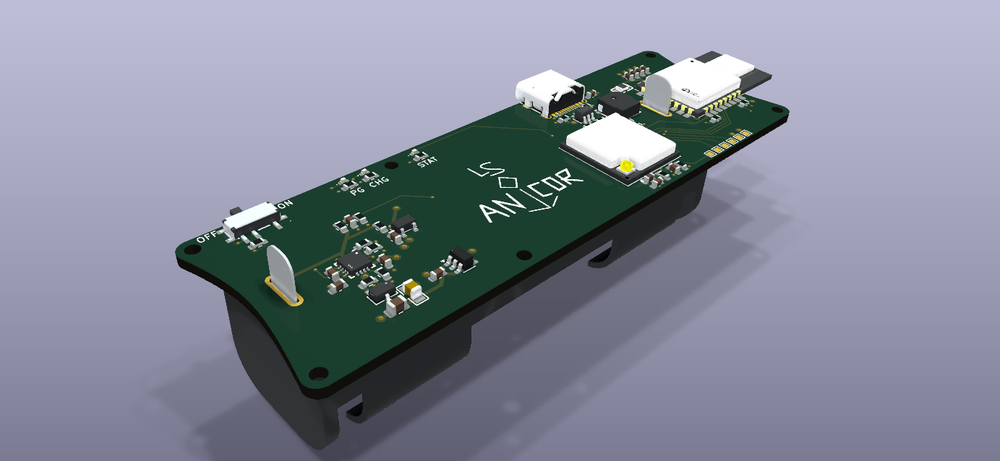
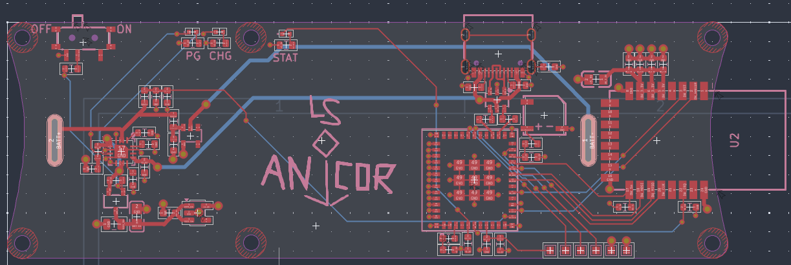
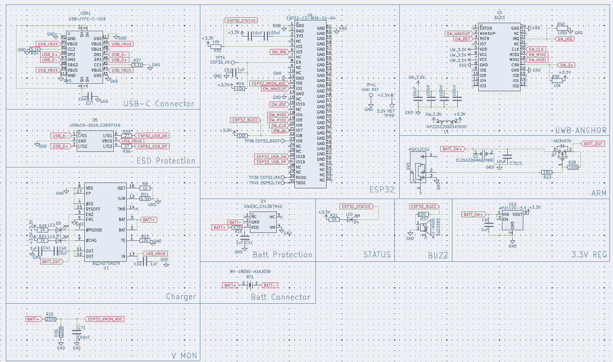

# LSwarm Anchor
A UWB Anchor made for the LSwarm micro drones

## Introduction
In an effort to make a cheaper alternative for micro drones, specifically for volumetric (3D) light displays, I designed drones that use an ultra-wide-band (UWB) module instead of an expensive gps to communicate with ground stations with UWB modules often called anchors. With three of these modules placed in a triangular formation, you can estimate the drone's specific position in 2D space. With four or more of these modules, you can precisely track the drone's position in a full 3D space. I recommend around 5 modules for more precision (also LCSC tends to offer pcbs in terms of 5 which makes this almost just as cheap), but four modules will work as well. 

I have not physically tested this device yet, but typically UWB modules can have a range of up to 100 meters or around 300 feet, which is more than enough for many applications. Also, UWB frequenceis can work through walls, but it may be less accurate or cause desyncing with the drone. 

Note: These anchors do not actively run the computations to position the drones, you must also have a dedicated ground station with wifi such as a Raspbbery PI Zero 2 W for computing.

## Bill of Materials (for 5 anchors)

| Quantity | Components | Price | Link |
|--------- |----------|----------| -----|
| 5  | 18650 Batteries | ~$33.93 (with shipping) | [here](https://liionwholesale.com/products/molicel-npe-inr-18650-m35a-10a-3500mah-flat-top-18650-battery-authorized-distributor?variant=32004772528197)
| 5 | 2.4G Wifi Antenna | ~$1.39 | select 5cm FPC-IPX4 cable from [here](https://www.aliexpress.us/item/3256802833801038.html?spm=a2g0o.productlist.main.17.44bbCrBdCrBdFl&algo_pvid=20d56933-2b0c-45d5-8601-1bc6a9682401&algo_exp_id=20d56933-2b0c-45d5-8601-1bc6a9682401-16&pdp_ext_f=%7B%22order%22%3A%221074%22%2C%22eval%22%3A%221%22%2C%22fromPage%22%3A%22search%22%7D&pdp_npi=6%40dis%21USD%213.55%213.52%21%21%213.55%213.52%21%402101ef5e17781321493642302e40a6%2112000023272348781%21sea%21US%217493938711%21X%211%210%21n_tag%3A-29913%3Bd%3A21b1ce8d%3Bm03_new_user%3A-29895&curPageLogUid=rLnZuf4b98Bi&utparam-url=scene%3Asearch%7Cquery_from%3A%7Cx_object_id%3A1005003020115790%7C_p_origin_prod%3A)
| 5  | LS Anchor PCBs | ~$10 (with shipping, cost can vary widely however) | Download repo, extract fabrication files, and fabricate through JLCPCB (complete instructions for this may come soon)
| 5  | Electrical Components for each PCB | ~$88.67 (this is on the high end, cost can vary widely) | See production BOM for a full list, the PCB fabrication files automatically include these components as well.
Total: $133.99

## Tools / Other parts:
- Hot-air reflow station or SMD hot plate
- Soldering iron + solder
- Solder paste for SMD components
- Tweezers for SMD components

For drone light displays, you'll also need the drones and a ground station.

## Assembly:
1. Apply solder paste to all smd components directly or through a stencil
2. Heat up components with a hot plate or hot-air gun
3. Solder on the battery connector and connect the battery
4. Plug in USB-C port and upload software